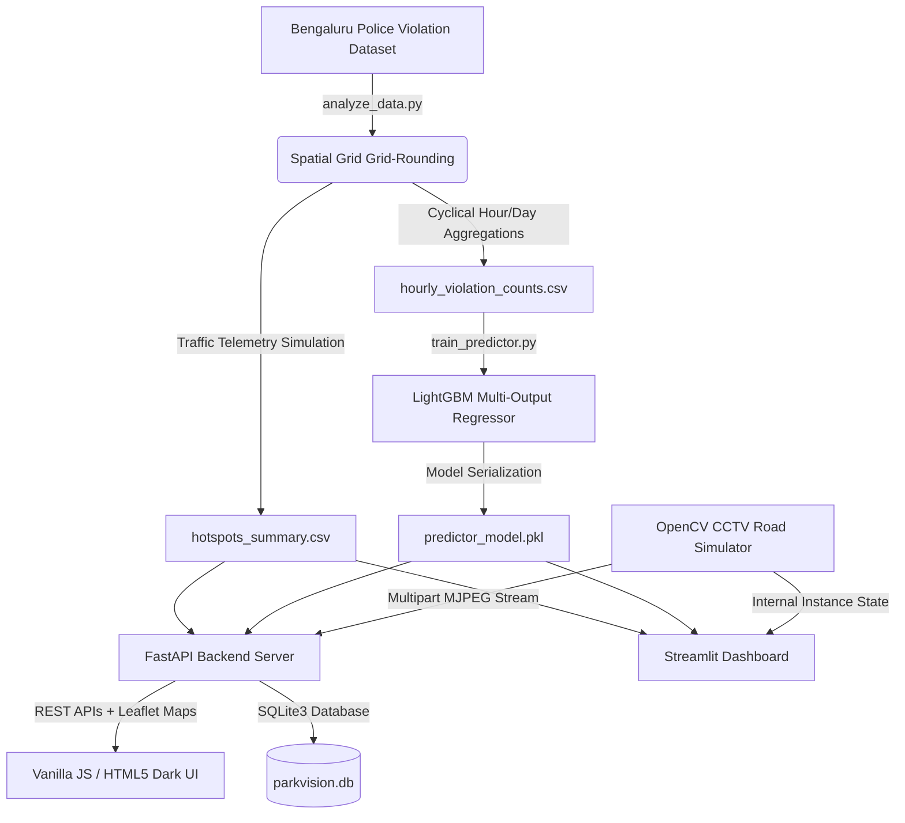

# ParkVision AI — Smart Parking & Congestion Intelligence Command Center
### Flipkart Grid 2026 — Round 2 Prototype

**Topic:** Poor Visibility on Parking-Induced Congestion  
**Objective:** Detect illegal on-street parking hotspots, quantify their real-time impact on traffic velocity, and prioritize enforcement dispatches using predictive machine learning.

---

## 1. System Architecture & Tech Stack



*   **Backend / API Server:** FastAPI (Python) - Serves static pages, handles live video streams, and hosts REST APIs.
*   **Database:** SQLite3 - Tracks dispatched units (tow trucks, wardens) and generated E-Challans.
*   **Machine Learning Engine:** LightGBM Regressor - Predicts hourly congestion levels and expected violations.
*   **Computer Vision Simulator:** OpenCV-based road canvas simulating vehicle polygon intersection testing.
*   **Web Interfaces:**
    *   **Vanilla JS Command Center (Primary):** Dark glassmorphic HTML5 page utilizing Leaflet.js with CartoDB Dark Matter tiles (simulating premium MapMyIndia dark traffic overlays) and Chart.js for real-time graphs.
    *   **Streamlit Command Center (Legacy Prototype / Redundant):** A rapid-prototype interface built in Python to test ML models and simulator logic before the custom frontend was developed.

---

## 2. Directory & Script Overview

The repository consists of the following key Python scripts and frontend assets:

| Script / Asset | Description |
| :--- | :--- |
| **`analyze_data.py`** | **Data Ingestion & Preprocessing:** Cleans and processes raw police violations, clusters coordinates into spatial grid blocks, simulates MapMyIndia speed telemetry and priority impact scores ($PCIS$). Generates `hotspots_summary.csv` and `hourly_violation_counts.csv`. |
| **`train_predictor.py`** | **Model Training:** Fits a multi-output LightGBM regressor (with Gradient Boosting fallback) to predict expected hourly violations and traffic velocity drops. Outputs the serialized model package `predictor_model.pkl`. |
| **`cv_simulator.py`** | **Computer Vision Simulator:** Generates a simulated CCTV road canvas with vehicle bounding boxes. Detects stationary vehicles inside a No Parking Zone ROI (Region of Interest) and triggers alerts when a threshold is breached. |
| **`main.py`** | **FastAPI Server Entrypoint:** Serves REST APIs, streams simulated CCTV video, manages the SQLite database, and serves the static HTML/JS frontend. |
| **`app.py`** | **Streamlit Dashboard (Legacy Prototype):** An alternative dashboard built using Streamlit. It is redundant now that the custom FastAPI glassmorphic UI is fully functional. |
| **`static/`** | **Frontend Assets:** Holds `index.html` (glassmorphic dark UI layout) and `app.js` (Leaflet.js map, API handlers, and charts). |
| **`start_dashboard.sh`** | **Launch Script:** Shell script to launch the FastAPI server. |

---

## 3. Mathematical Scoring Model

To rank and prioritize enforcement zones, we calculate the **Parking Congestion Impact Score ($PCIS$)** for each grid cell:

$$PCIS = V_{active} \times D_{avg} \times W_{vehicle} \times \left(\frac{\text{Free Flow Speed} - \text{Current Speed}}{\text{Free Flow Speed}}\right)$$

Where:
*   $V_{active}$: Volume of concurrently violating parked vehicles in the grid (estimated as a fraction of daily violations).
*   $D_{avg}$: Average duration of the violation (dwell time, set to a 25-minute baseline).
*   $W_{vehicle}$: Space footprint index based on vehicle class (Buses/Trucks = 3.0, Cars = 1.5, Autos = 1.2, Two-wheelers = 0.5).
*   $\text{Speed Reduction Ratio}$: MapMyIndia-simulated speed drop percentage due to lane constriction.

---

## 4. Prerequisites & Installation

### Step 1: Initialize a Virtual Environment (Recommended)
```bash
# Create a virtual environment
python3 -m venv venv

# Activate the virtual environment
source venv/bin/activate
```

### Step 2: Install Python Dependencies
```bash
pip install fastapi uvicorn pydantic lightgbm scikit-learn pandas numpy opencv-python folium streamlit-folium
```

---

## 5. Execution Pipeline (Step-by-Step)

> [!NOTE]
> **Step 3 (Preprocessing)** and **Step 4 (Model Training)** have already been pre-run. Their generated outputs (`hotspots_summary.csv`, `hourly_violation_counts.csv`, and `predictor_model.pkl`) are already included in the repository.
> 
> You can **skip directly to Step 5** to start the servers, unless you specifically want to modify the features or re-train the model.

### Step 3: Run Preprocessing & Telemetry Simulation `[PRE-COMPUTED - OPTIONAL]`
Aggregates rows of police violations into $111\text{m} \times 111\text{m}$ grid blocks, computes the $PCIS$, and builds the MapMyIndia speed telemetry.
```bash
python3 round2/analyze_data.py
```
*   *Output Files:* `round2/hotspots_summary.csv`, `round2/hourly_violation_counts.csv`

### Step 4: Train the ML Predictor Models `[PRE-COMPUTED - OPTIONAL]`
Fits a multi-output regressor to predict expected hourly violations and traffic velocity drops.
```bash
python3 round2/train_predictor.py
```
*   *Output File:* `round2/predictor_model.pkl`

### Step 5: Start the Interface (FastAPI + Vanilla JS UI)

Launch the primary glassmorphic interface (on port `8502`):

*   **Run via script:**
    ```bash
    ./round2/start_dashboard.sh
    ```
*   **Or run directly:**
    ```bash
    PYTHONPATH=. python3 -m uvicorn round2.main:app --host 0.0.0.0 --port 8502 --reload
    ```
*   *Access in browser at:* **`http://localhost:8502`**

> [!NOTE]
> There is also a legacy **Streamlit Admin Dashboard (`app.py`)** in the codebase. This was used as a rapid prototype during early development to test models and visual logic. You do **not** need to run it, as all features (and a much more polished user interface) are available via the main FastAPI server above. If you ever need to run it for comparison, use `streamlit run round2/app.py` (served on port `8501`).

---

## 6. Command Center Features

1. **Live CCTV Feed:** View the simulated OpenCV tracking frame showing ROI boundaries. Track vehicles, issue E-Challans, or dispatch tow trucks.
2. **City Congestion Map:** Interactive Leaflet / Folium map. Click circle markers to view speed reductions, current speeds, speed drops, and priority impact scores.
3. **AI Predictive Engine:** Select any of the 150 junctions, set the target day/hour, and run inference to forecast expected velocity loss.
4. **Analytics / Command Log:** Monitor historical choke points, vehicle class weights, and view past dispatches fetched dynamically.
# gridlockflipkart
